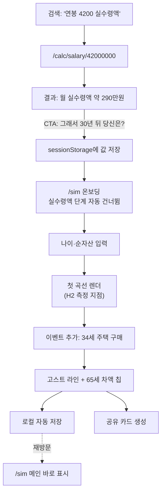

# PRD: 라이프커브(LifeCurve) MVP — 개발 기획서

| 항목 | 내용 |
| --- | --- |
| 문서 버전 | v1.0 (개발용) |
| 작성일 | 2026-10-09 |
| 기반 문서 | 라이프커브 제품 기획안 v1.0 (Notion · Lomeone > Project) |
| 범위 | MVP(6주) 상세 + v1·v2는 에픽 수준 |
| 독자 | 개발자 본인, AI 코딩 에이전트 |
| 상태 | 개발 착수 가능 — 단 §21 "결정 필요" 항목 중 🔴 표시는 해당 스토리 착수 전 확정 |

> **이 문서를 읽는 법**
> 제품 기획안이 "무엇을 왜 만드는가"라면, 이 문서는 "정확히 무엇을 어떤 순서로 만들고, 언제 끝났다고 말하는가"다.
> 유저 스토리(§8)는 각각 하나의 작업 세션에서 끝낼 수 있는 크기로 쪼갰고, 모든 스토리에 검증 가능한 완료 기준이 붙어 있다.
> 숫자·요율은 §11에, 엔진 알고리즘은 §10에 모여 있다. 구현 중 판단이 필요하면 그 두 장이 기준이다.

---

## 1. 개요

### 1.1 한 문장 정의

나이·월 실수령액·순자산 세 숫자만 넣으면 90세까지의 자산 곡선이 그려지고, 이직·주택 구매·출산·은퇴·목돈 이벤트를 얹으면 곡선이 그 자리에서 갈라지며 **"65세에 오늘 가치로 얼마가 바뀌는지"** 를 한 문장으로 알려주는 웹 서비스.

### 1.2 해결하는 문제

- 토스·뱅크샐러드는 **현재 자산 조회**와 **지난 지출 분석**에 머문다. "이 결정을 하면 내 미래가 어떻게 되나"에 답하는 도구가 한국에 없다.
- 기존 금융 계산기(실수령액, 대출이자 등)는 **답 하나를 주고 끝난다.** 사용자는 그 숫자가 인생 전체에서 무슨 의미인지 알 수 없다.
- 해외의 ProjectionLab·Boldin은 은퇴 중심이고 미국 세제 전용이다.

### 1.3 MVP가 증명해야 하는 가설 두 개

| # | 가설 | 측정 | 통과 기준 |
| --- | --- | --- | --- |
| H1 | 계산기를 쓴 사람은 "그래서 30년 뒤 나는?"에 반응한다 | 계산기 방문자 중 시뮬레이터 진입 비율 | **≥ 3%** (목표 8%) |
| H2 | 입력 3개면 사람들이 곡선을 끝까지 본다 | 시뮬레이터 진입자 중 첫 곡선 렌더 비율 | **≥ 60%** |

H1이 3% 미만이면 성장 모델 전체가 무너지므로 **제품을 더 만들기 전에 가설을 재설계**한다. 그래서 일정(§19)은 H1을 2주차에 먼저 측정하도록 짜여 있다.

---

## 2. 목표

### 2.1 MVP 목표 (6주)

- 연봉 실수령액 계산기를 **2주차 말까지 프로덕션 배포**하고 H1 측정을 시작한다.
- 헤드 계산기 5종을 국세청·공단 공식 계산기와 **원 단위로 일치**시킨다 (§18 골든 테스트).
- 시뮬레이터에서 **첫 곡선까지 60초 이내**, 입력 변경 후 곡선 갱신 **100ms 이내**.
- 사용자의 소득·자산 숫자를 **서버·URL·분석 도구 어디에도 보내지 않는다.**
- 계산기 페이지 모바일 **LCP ≤ 2.0초**, 초기 JS ≤ 170KB(gzip).

### 2.2 MVP 이후 (참고)

| 단계 | 시기 | 핵심 |
| --- | --- | --- |
| v1 | M3–M12 | 가입·월간 자산 스냅샷, 계산기 60종, 시나리오 A/B 비교, 몬테카를로, AI 시나리오 생성, 프로 플랜(₩79,000/년) |
| v2 | M13–M24 | 영문 + 미국 세제 모듈, 일본·영국, AI 재무 코치, 가구 합산 |

---

## 3. 범위

### 3.1 MVP에 포함

| 영역 | 포함 |
| --- | --- |
| 계산기 | 연봉 실수령액 · 주택담보대출 상환 · 전세 vs 월세 · 적립식 복리 · 퇴직금 (5종) + 연봉별 실수령액 정적 페이지 |
| 시뮬레이터 | 입력 3개 온보딩, 90세까지 곡선, 이벤트 5종, 가정값 패널, 이벤트 전후 고스트 라인 비교, 헤드라인 문장 |
| 저장 | 브라우저 로컬 저장 (비로그인) |
| 공유 | 결과 이미지 카드 (PNG 저장 / 기기 공유) |
| 신뢰 | 계산 기준 공개 페이지, 면책 고지, 개인정보처리방침 |
| 계측 | 금액을 포함하지 않는 이벤트 계측, H1·H2 퍼널 |

### 3.2 비목표 (MVP에서 하지 않는 것)

- **로그인·회원가입 없음.** 첫 곡선 전 가입 요구는 이탈을 만든다. v1에서 "저장하려 할 때" 처음 묻는다.
- **계좌·마이데이터 자동 연동 없음.** 본인신용정보관리업 허가(최소 자본금 5억원)가 필요하다. 수동 입력만.
- **AI 기능 없음.** 헤드라인 문장은 템플릿으로 만든다. LLM은 v1 유료 기능.
- **몬테카를로·확률 밴드 없음.** MVP 곡선은 결정론적 단일 경로.
- **이름 붙인 시나리오 여러 개 저장·나란히 비교 없음.** MVP는 "이벤트 추가 직전 곡선"과 "현재 곡선" 두 개만 겹쳐 보인다.
- **결제·요금제 없음.**
- **네이티브 앱 없음.** 유입이 100% 웹 검색이다.
- **특정 금융상품 추천 없음 — 영구 비목표.** 계산 도구로만 포지셔닝한다 (§17).
- **다국어 없음.** 단, 라우팅·문구 구조는 v2 영문화를 막지 않게 만든다 (FR-37).

---

## 4. 사용자와 핵심 시나리오

| 페르소나 | 유입 경로 | 이 사람이 원하는 한 가지 |
| --- | --- | --- |
| **지윤, 28세, 입사 2년차** | "연봉 4200 실수령액" 검색 | 내 월급으로 언제 1억을 모으고, 지금 페이스면 노후가 괜찮은지 |
| **민호, 34세, 신혼** | "전세 vs 월세 계산기" 검색 | 6억 집을 대출 끼고 지금 사는 것과 전세 유지 중 65세에 뭐가 나은지 |
| **수진, 41세, 이직 제안 받음** | "퇴직금 계산기" 검색 | 연봉 1,200만원 오르는 이직이 퇴직금 리셋을 감안해도 이득인지 |

세 사람 모두 **시뮬레이터를 찾아오지 않는다.** 계산기를 찾아왔다가 결과 화면 아래에서 시뮬레이터를 처음 만난다. 이 동선이 제품의 척추다.

---

## 5. 정보 구조와 URL

### 5.1 사이트맵

```
/                                   랜딩 (S-01)
/calc                               계산기 모음
/calc/salary                        연봉 실수령액 (S-02)
/calc/salary/[amount]               연봉별 실수령액 정적 페이지 (예: /calc/salary/42000000)
/calc/mortgage                      주택담보대출 상환
/calc/jeonse-vs-rent                전세 vs 월세
/calc/compound-savings              적립식 복리
/calc/severance                     퇴직금
/sim                                시뮬레이터 (S-03 온보딩 → S-04 메인)
/about/assumptions                  계산 기준과 가정 (S-07)
/legal/disclaimer                   면책 고지
/legal/privacy                      개인정보처리방침
/legal/terms                        이용약관
```

### 5.2 URL 규칙

- 슬러그는 영문 소문자 케밥케이스. 페이지 제목·본문은 한국어.
- 한국어가 기본 로케일이며 접두사 없이 루트에 둔다. v2 영문은 `/en/...` 로 추가한다.
- 끝 슬래시 없음. 대문자·쿼리 변형은 정규 URL로 301.
- **사용자가 입력한 금액은 절대 쿼리 파라미터에 싣지 않는다** (서버 로그·분석 도구 유출 방지, FR-27). 예외는 `/calc/salary/[amount]` 처럼 우리가 미리 생성한 정적 페이지뿐이다.

---

## 6. 화면 명세

모든 화면은 **모바일 우선**(360px 기준)으로 설계하고 1024px 이상에서 2단으로 확장한다. 라이트·다크 테마 모두 지원한다.

### S-01 랜딩 `/`

| 항목 | 내용 |
| --- | --- |
| 목적 | 직접 유입·브랜드 검색 사용자를 시뮬레이터로 보낸다 |
| 구성 | 헤드라인 + 샘플 곡선 애니메이션(1회, `prefers-reduced-motion` 시 정지) → "내 곡선 그려보기" 버튼 → 인기 계산기 5개 카드 → "숫자는 내 브라우저에만 남습니다" 안내 → 푸터(면책·처리방침) |
| 주요 동작 | 버튼 → `/sim` |
| 성공 기준 | 첫 화면(스크롤 없이)에 버튼이 보인다 |

### S-02 계산기 템플릿 `/calc/*`

5종 계산기가 공유하는 레이아웃이다.

| 영역 | 내용 |
| --- | --- |
| ① 제목 블록 | H1(예: "2026 연봉 실수령액 계산기"), 기준일("2026년 7월 1일 요율 기준"), 한 줄 설명 |
| ② 입력 폼 | 계산기별 입력(§12). 숫자 입력은 만원 단위 보조 표기("4,200만원"), 입력 즉시 계산(버튼 없음) |
| ③ 결과 | 핵심 숫자 1개를 크게 + 내역 표. 값이 바뀌면 숫자만 교체(레이아웃 이동 없음, CLS 0) |
| ④ **시뮬레이터 CTA** | 결과 바로 아래. 문구: **"그래서 30년 뒤 당신은? — 이 숫자로 내 곡선 그려보기"**. 결과가 계산된 뒤에만 활성화 |
| ⑤ 계산 방법 | 사용한 공식·요율·출처를 사람 말로 설명 (SEO·신뢰용, 400자 이상) |
| ⑥ 자주 묻는 질문 | 3–5개. 실제 검색 질의 기반 |
| ⑦ 관련 계산기 | 다른 계산기 3개 링크 |
| ⑧ 면책 한 줄 | "이 결과는 추정치이며 실제 금액과 다를 수 있습니다." + 링크 |

**상태**

- 빈 상태: 대표값(연봉 4,000만원 등)이 미리 채워져 결과가 처음부터 보인다. 빈 결과 화면을 보여주지 않는다.
- 입력 오류: 필드 아래에 무엇이 잘못됐고 어떻게 고치는지 쓴다. 예: "연봉은 1,200만원 이상으로 입력해 주세요. 최저임금 연 환산액보다 낮습니다."
- 계산 불가 범위(예: 연봉 10억 초과): "이 계산기는 연봉 10억원까지 지원합니다."

### S-03 시뮬레이터 온보딩 `/sim` (저장된 시나리오가 없을 때)

| 항목 | 내용 |
| --- | --- |
| 목적 | 15초 안에 입력 3개를 받고 곡선으로 넘긴다 |
| 구성 | 한 화면에 한 질문씩, 3단계: ① 나이 ② 월 실수령액 ③ 현재 순자산(음수 허용, "빚이 더 많으면 마이너스로") |
| 프리필 | 계산기 CTA로 들어오면 해당 값이 채워진 상태로 해당 단계를 건너뛴다 (US-012) |
| 진행 표시 | "1/3" 텍스트 |
| 완료 | ③ 입력 즉시 S-04로 전환, 곡선 그려지는 애니메이션 600ms |
| 이탈 방지 | 각 단계 "잘 모르겠어요" → 동년배 기본값 사용(§10.3) 후 진행 |

### S-04 시뮬레이터 메인 `/sim`

```
┌─────────────────────────────────────────────┐
│ 헤드라인 문장                                   │
│ "지금 계획대로면 65세에 오늘 가치로 3억 2천만원이   │
│  남고, 84세에 자산이 바닥납니다."                  │
├─────────────────────────────────────────────┤
│ [곡선 차트]  x: 나이(현재~90)  y: 순자산(실질)      │
│   ─ 현재 곡선   ┄ 직전 곡선(고스트)   │65세 마커    │
├─────────────────────────────────────────────┤
│ 이벤트 타임라인  [＋ 이벤트 추가]                   │
│  ● 34세 주택 구매   ● 37세 이직 +100만/월        │
├─────────────────────────────────────────────┤
│ 가정값 ▸ (접힘: 수익률 4% · 물가 2% · 은퇴 60세 …)  │
├─────────────────────────────────────────────┤
│ [공유 카드 만들기]   [처음부터 다시]                │
└─────────────────────────────────────────────┘
```

| 요소 | 명세 |
| --- | --- |
| 헤드라인 | §10.6 템플릿. 곡선과 동시에 갱신 |
| 차트 | 순자산 단일 선(기본). 토글로 "자산 구성 보기"(금융자산·부동산·부채 3개 선). 65세 세로 기준선 상시 표시. 자산이 0 아래로 내려가는 구간은 경고색 영역 |
| 툴팁 | 호버/터치 시 나이, 순자산, 금융자산, 부동산, 부채, 그 해 수입·지출 |
| 실질/명목 토글 | 기본 **"오늘 가치"**. "그해 금액"으로 전환 가능. 차트 우상단 |
| 고스트 라인 | 이벤트 추가·수정·삭제 직후, 변경 전 곡선을 점선으로 표시 + "65세 기준 +1억 2천만원" 차액 칩. 다음 변경 때 교체 |
| 이벤트 타임라인 | 나이순 칩 목록. 탭하면 S-05 편집 시트 |
| 가정값 패널 | §10.3 항목. 값 변경 시 즉시 재계산 |
| 경고 배너 | 금융자산이 음수가 되는 해가 있으면: "38세에 현금이 부족해집니다. 주택 구매 시점이나 대출액을 조정해 보세요." |

### S-05 이벤트 편집 시트

모바일은 하단 시트, 데스크톱은 우측 패널.

| 이벤트 | 입력 필드 | 기본값 |
| --- | --- | --- |
| 이직·연봉 변화 | 나이, 월 실수령액 변화(±만원, 오늘 가치) | 현재+3세, +50만원 |
| 주택 구매 | 나이, 집값(오늘 가치), 대출액, 대출 금리, 상환 기간, 상환 방식 | 현재+3세, 6억, 3.6억, 4.0%, 30년, 원리금균등 |
| 출산·자녀 | 나이, 자녀 수(1–3) | 현재+2세, 1명 |
| 은퇴 시점 | 은퇴 나이 | 60세 |
| 목돈 유입·유출 | 나이, 금액(±, 오늘 가치), 메모(예: "결혼자금") | 현재+1세, −3,000만원 |

- 저장 버튼 문구는 동작 그대로: "이벤트 추가" / "변경 저장" / "이벤트 삭제".
- 삭제는 확인 대화상자 없이 실행하고 5초간 "되돌리기" 토스트를 띄운다 (브라우저 `confirm()` 금지).
- MVP 이벤트 최대 10개. 초과 시 "이벤트는 10개까지 추가할 수 있습니다."

### S-06 공유 카드

| 항목 | 내용 |
| --- | --- |
| 형태 | 1080×1350 PNG(인스타그램 세로 비율), 클라이언트 캔버스에서 생성 |
| 내용 | 곡선 모양, 나이 축, 65세 마커, 이벤트 아이콘, 서비스 로고·URL |
| **금액 표시** | **기본 꺼짐.** 토글로 켜면 65세 순자산 한 개만 표시 (🔴 §21 D-5) |
| 동작 | "이미지 저장"(다운로드) / "공유하기"(Web Share API 지원 기기만, 미지원 시 버튼 숨김) |
| 서버 | 이미지를 서버에 업로드하지 않는다 |

### S-07 계산 기준과 가정 `/about/assumptions`

- 세제 룰셋 버전, 적용 기간, 요율 표, 출처 링크 (§11 표를 사람이 읽는 형태로).
- 시뮬레이터 기본 가정값과 그렇게 정한 이유.
- 알려진 한계: "국민연금은 간이 추정이며 실제 예상액은 국민연금공단에서 확인하세요" 등.
- 마지막 갱신일. 룰셋 파일에서 자동 생성한다 (수작업 동기화 금지).

---

## 7. 사용자 플로우



---

## 8. 유저 스토리

스토리 ID 순서는 에픽 기준이다. **구현 순서는 §19 일정표를 따른다.**
모든 스토리의 공통 완료 기준: `pnpm typecheck && pnpm lint && pnpm test` 통과, PR 프리뷰 배포 성공. 아래에는 반복하지 않는다.
UI가 있는 스토리는 추가로 **"브라우저에서 360px·1280px, 라이트·다크 4가지 조합으로 직접 확인"** 이 완료 기준에 포함된다 (🖥 표시).

### E1. 프로젝트 기반

#### US-001: 모노레포와 CI 구성
**설명:** 개발자로서, 엔진·룰셋·웹을 분리된 패키지로 관리해서 엔진을 UI 없이 테스트하고 싶다.

**완료 기준:**
- [ ] pnpm workspaces: `apps/web`, `packages/engine`, `packages/rules`
- [ ] `packages/engine`은 외부 런타임 의존성 0개 (devDependency만 허용)
- [ ] TypeScript `strict: true`, `noUncheckedIndexedAccess: true`
- [ ] GitHub Actions: PR마다 typecheck·lint·test 실행, 실패 시 머지 차단
- [ ] Vercel 프리뷰 배포가 PR에 링크로 달린다

#### US-002: 디자인 토큰과 기본 레이아웃 🖥
**설명:** 사용자로서, 어떤 페이지에서든 일관된 화면과 면책 고지 링크를 보고 싶다.

**완료 기준:**
- [ ] 색·타이포·간격 토큰이 CSS 변수로 정의되고 라이트/다크 둘 다 존재
- [ ] 시스템 다크모드 설정을 따른다
- [ ] 헤더(로고·계산기·시뮬레이터 링크), 푸터(면책·처리방침·약관·계산 기준 링크)
- [ ] 키보드 포커스가 모든 인터랙티브 요소에서 보인다

### E2. 세제 룰셋

#### US-003: 룰셋 스키마와 2026 한국 시드
**설명:** 개발자로서, 세율·요율을 코드가 아닌 데이터 파일로 관리해서 세법이 바뀌면 파일만 교체하고 싶다.

**완료 기준:**
- [ ] `packages/rules/schema.ts`에 zod 스키마 (§11.1)
- [ ] `packages/rules/kr/2026-01.json`, `kr/2026-07.json` 두 파일 (국민연금 기준소득월액 상·하한이 7월에 바뀜)
- [ ] `getRuleset(country, date)` — 날짜에 맞는 파일을 반환. 테스트: `2026-06-30` → 상한 637만원, `2026-07-01` → 659만원
- [ ] 모든 수치 필드에 `source` URL과 `verifiedAt` 날짜가 있다. 하나라도 비면 테스트 실패
- [ ] 빌드 시 스키마 검증 — 잘못된 룰셋이면 빌드 실패

#### US-004: 근로소득 간이세액표 데이터화
**설명:** 개발자로서, 실수령액 계산이 회사 원천징수와 같은 결과가 나오도록 국세청 간이세액표를 그대로 쓰고 싶다.

**완료 기준:**
- [ ] 국세청 공식 간이세액표를 `kr/withholding-2026.json`으로 변환하는 스크립트 `scripts/build-withholding.ts` (원본 파일은 `data/raw/`에 보관)
- [ ] `lookupWithholding(monthlyTaxable, dependents, childrenAge8to20)` → 원 단위 소득세
- [ ] 표의 최상단 구간(월 1,000만원 초과)은 국세청 고시 산식으로 계산
- [ ] 표에서 무작위 50개 셀을 뽑아 원본과 대조하는 테스트

### E3. 계산기

#### US-005: 연봉 실수령액 계산 함수
**설명:** 사용자로서, 내 연봉의 월 실수령액과 공제 내역을 회사 급여명세서와 같은 수준으로 알고 싶다.

**완료 기준:**
- [ ] `calcSalaryTakeHome(input, ruleset)` 순수 함수 (§12.1)
- [ ] 출력: 월 세전, 국민연금, 건강보험, 장기요양, 고용보험, 소득세, 지방소득세, 공제 합계, 월 실수령액, 연 실수령액
- [ ] 골든 테스트 30건 (§18.2): 4대보험 각 항목 **오차 0원**, 소득세 **오차 0원**
- [ ] 실수령액 → 세전 연봉 역산 함수 `solveGrossFromTakeHome()` (시뮬레이터 국민연금 추정에 사용). 역산 결과를 다시 정산하면 원래 실수령액과 ±1,000원 이내

#### US-006: 연봉 실수령액 페이지 🖥
**설명:** 사용자로서, 연봉을 입력하면 바로 실수령액과 내역을 보고 싶다.

**완료 기준:**
- [ ] S-02 템플릿 적용, 기본값 연봉 4,000만원·부양가족 1명·비과세 식대 월 20만원
- [ ] 입력 변경 후 결과 갱신 50ms 이내 (서버 호출 없음)
- [ ] 결과 숫자가 바뀌어도 레이아웃이 움직이지 않는다 (숫자 영역 고정폭, `tabular-nums`)
- [ ] "계산 방법" 섹션에 적용 요율과 기준일이 룰셋에서 자동으로 표시된다
- [ ] 결과 계산 전에는 CTA가 비활성

#### US-007: 연봉별 실수령액 정적 페이지 🖥
**설명:** 검색 사용자로서, "연봉 4200 실수령액"을 검색했을 때 바로 그 금액의 답이 있는 페이지에 닿고 싶다.

**완료 기준:**
- [ ] `/calc/salary/[amount]` — 2,400만원부터 1억 2,000만원까지 100만원 단위 97개 페이지를 빌드 시 정적 생성
- [ ] 각 페이지: 해당 연봉의 실수령액 표(부양가족 1–4명별), 위·아래 100만원 페이지 링크, 같은 계산기 위젯(값 프리필)
- [ ] `<title>` 형식: "연봉 4,200만원 실수령액 — 2026년 월 약 ○○○만원" (숫자는 빌드 시 계산)
- [ ] 각 페이지 canonical은 자기 자신
- [ ] 출시 후 4주간 Search Console에서 "크롤링됨 - 현재 색인 생성되지 않음" 비율을 모니터링하고 50%를 넘으면 페이지 수를 500만원 단위로 축소 (§20 출시 후 점검)

#### US-008: 주택담보대출 상환 계산기 🖥
**설명:** 사용자로서, 대출액·금리·기간으로 월 상환액과 총 이자를 알고 싶다.

**완료 기준:**
- [ ] 상환 방식 3종: 원리금균등, 원금균등, 만기일시
- [ ] 거치 기간(0–5년) 지원
- [ ] 출력: 첫 달 상환액, 총 이자, 총 상환액, 연도별 잔액 표(접기)
- [ ] 원리금균등 결과가 표준 공식과 원 단위 일치 (테스트 10건)

#### US-009: 전세 vs 월세 비교 계산기 🖥
**설명:** 사용자로서, 같은 집을 전세로 살 때와 월세로 살 때 실제 월 비용이 얼마나 다른지 알고 싶다.

**완료 기준:**
- [ ] 입력: 전세 보증금, 전세대출 비율·금리, 월세 보증금, 월세, 내 돈의 기회비용 수익률, 거주 기간
- [ ] 출력: 각 방식의 월 환산 비용, 거주 기간 총비용, 어느 쪽이 얼마 유리한지 한 문장
- [ ] 계산식은 §12.3, 페이지 "계산 방법"에 그대로 노출

#### US-010: 적립식 복리 계산기 🖥
**설명:** 사용자로서, 매달 얼마씩 넣으면 몇 년 뒤 얼마가 되는지 알고 싶다.

**완료 기준:**
- [ ] 입력: 초기 금액, 월 납입액, 연 수익률, 기간, 세금 처리(일반과세 15.4% / 비과세)
- [ ] 출력: 만기 금액, 원금, 수익, 연도별 증가 차트 (단일 계열)
- [ ] "목표 금액까지 몇 년?" 역산 모드

#### US-011: 퇴직금 계산기 🖥
**설명:** 사용자로서, 지금 퇴사하면 퇴직금이 얼마인지 알고 싶다.

**완료 기준:**
- [ ] 입력: 입사일, 퇴사(예정)일, 최근 3개월 급여 총액, 연간 상여금, 연차수당
- [ ] 계속근로 1년 미만이면 "퇴직금 지급 대상이 아닙니다(계속근로 1년 이상부터)" 안내
- [ ] 출력: 1일 평균임금, 퇴직금(세전). 퇴직소득세는 MVP 제외 — "세전 금액입니다" 명시
- [ ] 퇴직 전 3개월 일수는 실제 달력 일수로 계산 (테스트: 2월 포함 구간)

#### US-012: 계산기 → 시뮬레이터 핸드오프
**설명:** 계산기 사용자로서, CTA를 눌렀을 때 방금 넣은 숫자를 다시 입력하지 않고 바로 곡선을 보고 싶다.

**완료 기준:**
- [ ] CTA 클릭 시 프리필 값을 `sessionStorage['lc.handoff']`에 저장 (§13.3 형식), URL에는 `?from=salary` 처럼 **출처만** 싣는다
- [ ] `/sim` 진입 시 handoff를 읽고 즉시 삭제
- [ ] 매핑: 실수령액→월 실수령액 / 주담대→주택 구매 이벤트 초안 / 전세vs월세→없음(출처만) / 적립식→월 저축액 가정값 / 퇴직금→없음(출처만)
- [ ] 분석 이벤트 `sim_started`의 `source` 속성에 출처가 기록된다
- [ ] 네트워크 탭에서 금액이 어떤 요청에도 실리지 않음을 확인 (E2E 테스트로 자동화)

### E4. 시뮬레이션 엔진

#### US-013: 기본 곡선 계산
**설명:** 개발자로서, 입력과 가정값을 넣으면 나이별 자산 시계열을 돌려주는 순수 함수가 필요하다.

**완료 기준:**
- [ ] `simulate(input: SimInput): SimResult` — §10 알고리즘 그대로
- [ ] 자산 3버킷(금융자산·부동산·부채)과 순자산, 실질·명목 모두 출력
- [ ] 같은 입력이면 항상 같은 출력 (난수·현재 시각 사용 금지, 기준 연도는 입력으로 받는다)
- [ ] 손으로 계산한 스프레드시트 골든 시나리오 5개와 원 단위 일치 (§18.3)

#### US-014: 이벤트 5종 적용
**설명:** 사용자로서, 인생 이벤트를 넣으면 그 효과가 정확히 그 나이부터 반영되길 원한다.

**완료 기준:**
- [ ] §10.5의 이벤트별 효과 정의를 구현
- [ ] 이벤트별 단위 테스트: 이벤트 발생 전 연도의 값이 이벤트 없는 결과와 완전히 같다
- [ ] 같은 나이에 이벤트 여러 개가 있으면 정의된 순서(§10.4 ③)로 적용
- [ ] 이벤트 나이가 현재 나이보다 작거나 90을 넘으면 검증 오류를 반환 (throw 금지, 결과 타입으로)

#### US-015: 요약 지표와 헤드라인 문장
**설명:** 사용자로서, 차트를 해석하지 않아도 내 상황을 한 문장으로 알고 싶다.

**완료 기준:**
- [ ] `summarize(result)` → 65세 실질 순자산, 자산 고갈 나이(없으면 null), 최저 금융자산과 그 나이
- [ ] `compare(before, after)` → 65세 실질 순자산 차액, 고갈 나이 변화
- [ ] 헤드라인 템플릿 §10.6의 6가지 경우를 모두 테스트
- [ ] 금액 표기 규칙: 1억 이상 "3억 2천만원", 1억 미만 "4,800만원", 음수 "−1,200만원" (반올림 1천만/100만 단위)

#### US-016: 웹 워커 실행
**설명:** 개발자로서, v1 몬테카를로를 붙일 때 UI 구조를 바꾸지 않도록 처음부터 워커에서 엔진을 돌리고 싶다.

**완료 기준:**
- [ ] 엔진을 Web Worker에서 실행, 메인 스레드는 비동기 인터페이스로 호출
- [ ] 빠른 연속 입력 시 마지막 요청 결과만 반영 (요청 ID로 오래된 응답 폐기)
- [ ] 중급 안드로이드 기준(Chrome DevTools CPU 4× 감속) 입력 → 곡선 갱신 100ms 이내

### E5. 시뮬레이터 UI

#### US-017: 3단계 온보딩 🖥
**설명:** 처음 온 사용자로서, 질문 3개에 답하면 바로 내 곡선을 보고 싶다.

**완료 기준:**
- [ ] S-03 명세대로 한 화면 한 질문
- [ ] 숫자 키패드가 뜬다 (`inputmode="numeric"`)
- [ ] "잘 모르겠어요" 선택 시 §10.3 동년배 기본값 적용 + 곡선 화면에 "기본값으로 그린 곡선입니다" 표시 (🔴 D-3 확정 전에는 버튼을 숨긴다)
- [ ] 핸드오프 값이 있으면 해당 단계를 건너뛴다
- [ ] 온보딩 시작부터 곡선 렌더까지 실측 중앙값 15초 이내 (사내 테스트 5명)

#### US-018: 자산 곡선 차트 🖥
**설명:** 사용자로서, 내 순자산이 나이에 따라 어떻게 변하는지 한눈에 보고 싶다.

**완료 기준:**
- [ ] SVG 기반, x축 나이(현재–90), y축 순자산
- [ ] 65세 세로 기준선과 라벨 상시 표시
- [ ] 호버(데스크톱)·터치 드래그(모바일) 시 크로스헤어 + 툴팁 (S-04 항목)
- [ ] 순자산 < 0 구간은 경고 색 영역으로 채운다 (색 + 패턴, 색만으로 구분하지 않음)
- [ ] "자산 구성 보기" 토글: 3개 선 + 범례 + 끝점 직접 라벨
- [ ] 차트 아래 "표로 보기" 접기 — 5세 간격 표 (스크린리더 대체 수단)
- [ ] 실질/명목 토글

#### US-019: 이벤트 추가·편집·삭제 🖥
**설명:** 사용자로서, 인생 이벤트를 곡선 위에 얹고 고치고 지우고 싶다.

**완료 기준:**
- [ ] S-05 명세의 5종 폼과 기본값
- [ ] 저장 즉시 곡선 갱신 + 고스트 라인
- [ ] 삭제 후 5초 "되돌리기" 토스트
- [ ] 차트 위 해당 나이에 이벤트 아이콘 마커, 탭하면 편집 시트
- [ ] 10개 초과 추가 시 안내 문구

#### US-020: 고스트 라인 비교 🖥
**설명:** 사용자로서, 방금 바꾼 결정이 내 미래를 얼마나 바꿨는지 보고 싶다.

**완료 기준:**
- [ ] 이벤트·가정값 변경 직후 이전 곡선을 점선으로 유지
- [ ] 차트 위 칩: "65세 기준 +1억 2천만원" (증가는 accent 색, 감소는 경고 색, 부호 표기 필수)
- [ ] 다음 변경 시 고스트가 교체된다. "비교 끄기" 버튼으로 숨김

#### US-021: 가정값 패널 🖥
**설명:** 사용자로서, 기본 가정이 내 상황과 다르면 직접 고치고 싶다.

**완료 기준:**
- [ ] §10.3의 사용자 수정 가능 항목만 노출, 각 항목 옆 "왜 이 값인가요?" 설명 팝오버
- [ ] 허용 범위 밖 입력 시 오류 문구 (예: "수익률은 −5%에서 15% 사이로 입력해 주세요.")
- [ ] "기본값으로 되돌리기"

### E6. 저장·공유

#### US-022: 로컬 자동 저장
**설명:** 재방문 사용자로서, 다시 들어왔을 때 내 곡선이 그대로 있길 원한다.

**완료 기준:**
- [ ] 변경 후 500ms 디바운스로 `localStorage['lc.scenario']`에 저장 (§13.1 스키마)
- [ ] 스키마 `version` 필드 + 마이그레이션 함수. 알 수 없는 버전이면 덮어쓰지 않고 "저장된 데이터를 불러올 수 없습니다. 새로 시작할까요?" 표시
- [ ] 저장소 접근이 막힌 환경(시크릿 모드 등)에서도 시뮬레이터가 동작하고, "이 브라우저에서는 저장되지 않습니다" 안내
- [ ] "처음부터 다시"는 확인 후 저장 데이터를 삭제 (5초 되돌리기)

#### US-023: 공유 카드 🖥
**설명:** 사용자로서, 내 곡선을 이미지로 저장하거나 친구에게 보내고 싶다.

**완료 기준:**
- [ ] S-06 명세대로 1080×1350 PNG를 캔버스로 생성
- [ ] 금액 표시 토글 기본 꺼짐
- [ ] Web Share API(파일 공유) 지원 시 "공유하기", 아니면 "이미지 저장"만
- [ ] 생성 과정에서 네트워크 요청 0건

### E7. SEO와 신뢰

#### US-024: 메타데이터·구조화 데이터·사이트맵
**설명:** 개발자로서, 모든 계산기 페이지가 검색엔진에 정확히 이해되게 하고 싶다.

**완료 기준:**
- [ ] 페이지별 고유 `<title>`, `description`, canonical, OG 이미지(빌드 시 생성)
- [ ] JSON-LD: 계산기 페이지에 `WebApplication`(applicationCategory: FinanceApplication) + `BreadcrumbList`, FAQ 블록에 `FAQPage`
- [ ] `sitemap.xml` 자동 생성 (정적 페이지 포함), `robots.txt`
- [ ] 네이버 서치어드바이저·Google Search Console 소유 확인 메타 태그 (값은 환경 변수)
- [ ] Lighthouse SEO 100

#### US-025: 계산 기준 페이지 🖥
**설명:** 신중한 사용자로서, 이 숫자들이 어디서 나왔는지 확인하고 싶다.

**완료 기준:**
- [ ] S-07 명세. 요율 표는 룰셋 JSON에서 빌드 시 생성
- [ ] 각 계산기 "계산 방법" 섹션에서 이 페이지의 해당 앵커로 링크

### E8. 계측

#### US-026: 분석 이벤트 계측
**설명:** 개발자로서, H1·H2 가설을 금액 데이터 없이 측정하고 싶다.

**완료 기준:**
- [ ] Plausible(쿠키 없음)로 §16의 이벤트 전부 전송
- [ ] 이벤트 속성에 금액·나이 원값이 없다 — 나이는 10세 구간(`30s`)으로만
- [ ] H1·H2 퍼널 목표(Goal)가 Plausible에 설정됨
- [ ] 개발 환경에서는 전송하지 않고 콘솔에 출력

### E9. 법적 고지

#### US-027: 면책·개인정보처리방침·약관 + 금지 표현 검사 🖥
**설명:** 운영자로서, 투자자문으로 오해받거나 개인정보 문제가 생기지 않게 하고 싶다.

**완료 기준:**
- [ ] `/legal/*` 3개 페이지 (§17.2 문구 기반, 출시 전 법률 검토 반영 🔴 §21 D-2)
- [ ] 모든 계산 결과·헤드라인 근처에 면책 한 줄
- [ ] CI 스크립트 `scripts/lint-copy.ts`: UI 문구 파일에서 §17.1 금지 표현이 발견되면 실패

### E10. 가설 검증 (2주차 선출시)

#### US-028: 시뮬레이터 미리보기 페이지 🖥
**설명:** 운영자로서, 시뮬레이터가 완성되기 전에 CTA 클릭률(H1)을 먼저 측정하고 싶다.

**완료 기준:**
- [ ] 2–4주차 동안 `/sim`이 미리보기 페이지를 보여준다: 샘플 곡선 이미지 + "곧 공개됩니다" + 공개 예정일
- [ ] 이메일 수집 여부는 🔴 §21 D-6 결정에 따른다. 수집하지 않는 경우 버튼 없음
- [ ] CTA 클릭은 이 기간에도 `sim_started`로 계측된다
- [ ] 5주차에 실제 시뮬레이터로 교체할 때 URL 변경 없음

---

## 9. 기능 요구사항

### 계산기 공통
- **FR-1** 모든 계산은 브라우저에서 수행하고 서버 API를 호출하지 않는다.
- **FR-2** 입력이 바뀌면 버튼 없이 즉시 재계산한다.
- **FR-3** 모든 계산기는 대표값이 미리 채워진 상태로 열리고 결과가 처음부터 보인다.
- **FR-4** 금액 입력 필드는 쉼표 자동 포맷과 "4,200만원" 형태의 보조 표기를 보여준다.
- **FR-5** 결과 아래 시뮬레이터 CTA를 두며, 결과가 유효할 때만 활성화한다.
- **FR-6** 각 계산기 페이지는 적용 룰셋의 기준일을 제목 블록에 표시한다.
- **FR-7** 계산기 결과 영역은 값이 바뀌어도 레이아웃이 이동하지 않는다.

### 세제 룰셋
- **FR-8** 세율·요율·상하한·공제액은 `packages/rules`의 JSON에서만 읽는다. 코드에 하드코딩된 요율이 있으면 리뷰에서 반려한다.
- **FR-9** 룰셋은 적용 시작일을 가지며, 계산 기준일에 맞는 룰셋을 자동 선택한다.
- **FR-10** 룰셋의 모든 수치 필드는 출처 URL과 확인일을 가진다.

### 시뮬레이터
- **FR-11** 온보딩은 나이, 월 실수령액, 현재 순자산 세 값만 필수로 받는다.
- **FR-12** 나이 입력 범위 19–64세. 순자산은 −10억원 ~ +100억원.
- **FR-13** 시뮬레이션은 현재 나이부터 90세까지 연 단위로 계산한다.
- **FR-14** 차트 기본 표시는 실질(오늘 가치) 금액이며 명목으로 전환할 수 있다.
- **FR-15** 사용자가 입력하는 모든 이벤트 금액은 오늘 가치로 받는다.
- **FR-16** 65세 기준선을 항상 표시한다.
- **FR-17** 이벤트·가정값이 바뀌면 변경 전 곡선을 고스트 라인으로 보여주고 65세 실질 순자산 차액을 표시한다.
- **FR-18** 금융자산이 음수가 되는 연도가 있으면 첫 해를 경고 배너로 알린다.
- **FR-19** 헤드라인 문장을 템플릿으로 생성해 차트 위에 표시한다.
- **FR-20** 이벤트는 최대 10개.
- **FR-21** 엔진은 Web Worker에서 실행하고, 오래된 계산 응답은 버린다.

### 저장·공유
- **FR-22** 시나리오는 브라우저 localStorage에만 저장한다.
- **FR-23** 저장 데이터는 스키마 버전을 가지며 하위 버전은 자동 마이그레이션한다.
- **FR-24** 저장소를 쓸 수 없는 환경에서도 시뮬레이터는 동작한다.
- **FR-25** 공유 카드는 클라이언트에서 생성하고 서버에 업로드하지 않는다.
- **FR-26** 공유 카드의 금액 표시는 기본 꺼짐이다.

### 개인정보·보안
- **FR-27** 사용자 입력 금액·나이는 어떤 네트워크 요청의 본문·헤더·URL에도 포함되지 않는다.
- **FR-28** 계산기 → 시뮬레이터 값 전달은 sessionStorage로만 한다.
- **FR-29** 분석 도구는 쿠키를 쓰지 않는 도구를 사용하며, 나이는 10세 구간으로만 보낸다.
- **FR-30** 제3자 스크립트는 분석 1종 외에 넣지 않는다 (광고 스크립트는 MVP 제외).
- **FR-31** CSP 헤더로 스크립트 출처를 자기 도메인과 분석 도구로 제한한다.

### SEO·성능·접근성
- **FR-32** 계산기 페이지는 정적 생성(SSG)하고, 계산 위젯만 클라이언트에서 하이드레이션한다.
- **FR-33** 계산기 페이지 모바일 LCP ≤ 2.0초, CLS ≤ 0.05, INP ≤ 200ms.
- **FR-34** 계산기 페이지 초기 JS ≤ 170KB(gzip), 시뮬레이터 ≤ 250KB. (10/09 개정: 프레임워크 기본값만 135KB라 120/200KB에서 상향, review B-3)
- **FR-35** 모든 페이지 WCAG 2.2 AA 대비, 키보드 조작 가능, `prefers-reduced-motion` 존중.
- **FR-36** 차트는 동일 내용의 표 대체 수단을 가진다.
- **FR-37** UI 문구는 컴포넌트에 직접 쓰지 않고 `apps/web/copy/ko.ts`에 모은다 (v2 영문화 대비, 금지 표현 검사 대상).

---

## 10. 시뮬레이션 엔진 명세

### 10.1 설계 원칙

1. **순수 함수.** `simulate(input) → result`. 입출력 외 부작용 없음. 현재 날짜도 입력으로 받는다 (`baseYear`).
2. **연 단위 이산 계산.** 월 단위는 MVP에서 불필요한 정밀도다. 단, 대출 상환은 내부적으로 월 단위로 계산해 연 합계를 낸다.
3. **금액 단위는 원(정수).** 부동소수점 누적 오차를 막기 위해 매 연도 끝에 `Math.round`.
4. **입력은 오늘 가치, 계산은 명목, 출력은 둘 다.** 사용자는 오늘 돈으로 생각하므로 입력을 오늘 가치로 받고, 엔진 내부에서 명목으로 바꿔 계산한 뒤, 실질(오늘 가치)과 명목을 모두 돌려준다.
5. **세후 수익률 가정.** MVP는 금융자산 수익에 대한 세금을 따로 계산하지 않는다. 사용자가 입력하는 수익률을 세후로 간주하고 가정값 패널에 그렇게 명시한다.

### 10.2 입력 타입

```ts
type Won = number; // 원 단위 정수

interface SimInput {
  baseYear: number;            // 계산 기준 연도, 예: 2026
  age: number;                 // 19–64
  monthlyTakeHome: Won;        // 현재 월 실수령액
  netWorth: Won;               // 현재 순자산 (음수 가능). 전부 금융자산으로 시작한다
  assumptions: Assumptions;
  events: LifeEvent[];
}

interface Assumptions {
  monthlySpend: Won;           // 오늘 가치. 기본값 = 월 실수령액 × 0.70
  nominalReturn: number;       // 금융자산 세후 명목 수익률. 기본 0.040
  inflation: number;           // 기본 0.020
  wageGrowth: number;          // 명목 임금상승률. 기본 0.030
  housingGrowth: number;       // 명목 주택가격 상승률. 기본 0.020
  retirementAge: number;       // 기본 60
  pensionStartAge: number;     // 기본 65 (1969년 이후 출생자 기준)
  pensionJoinAge: number;      // 국민연금 가입 시작 나이. 기본 27
  childCostPerYear: Won;       // 자녀 1인 연간 양육비(오늘 가치). 🔴 §21 D-3
  horizonAge: 90;
}

type LifeEvent =
  | { id: string; type: 'job_change'; age: number; deltaMonthlyTakeHome: Won }
  | { id: string; type: 'home_purchase'; age: number; price: Won; loan: Won;
      rate: number; termYears: number; method: 'annuity' | 'equal_principal' }
  | { id: string; type: 'child'; age: number; count: 1 | 2 | 3 }
  | { id: string; type: 'retirement'; age: number }
  | { id: string; type: 'lump_sum'; age: number; amount: Won; memo?: string };
```

### 10.3 기본 가정값

| 항목 | 기본값 | 사용자 수정 | 근거 / 상태 |
| --- | --- | --- | --- |
| 월 지출 | 실수령액의 70% | ✅ | 저축률 30% 가정. 🔴 통계청 가계동향 기반으로 연령대별 값 확정 (D-3) |
| 금융자산 수익률(세후, 명목) | 4.0% | ✅ (−5%~15%) | 예금·채권·주식 혼합 보수적 가정 |
| 물가상승률 | 2.0% | ✅ (0%~6%) | 한국은행 물가안정목표 2% |
| 임금상승률(명목) | 3.0% | ✅ (0%~10%) | 가정 |
| 주택가격 상승률(명목) | 2.0% | ✅ (−5%~10%) | 물가 수준 가정 |
| 은퇴 나이 | 60 | ✅ (40–75) | 법정 정년 |
| 국민연금 수급 나이 | 65 | ✅ (60–70) | 1969년 이후 출생자 수급 개시 연령 |
| 국민연금 가입 시작 나이 | 27 | ✅ | 가정 |
| 자녀 1인 연간 양육비 | 🔴 미정 | ✅ | D-3에서 출처와 함께 확정 |
| 계산 종료 나이 | 90 | ❌ | 고정 |

**"잘 모르겠어요" 기본값 (온보딩용):** 나이를 모르는 경우는 없으므로 나이는 필수. 실수령액과 순자산은 🔴 D-3에서 통계청 자료로 연령대별 중앙값 표를 만들어 `packages/rules/kr/benchmarks-2026.json`에 넣는다. 그 전까지는 "잘 모르겠어요" 버튼을 숨긴다.

### 10.4 연간 루프

```
t = 0 … (90 − age)        // t년 후
A = age + t               // 그 해의 나이
F_t = (1 + inflation)^t   // 실질 → 명목 변환 계수

상태: fin(금융자산), prop(부동산), debt(부채), takeHome(현재 월 실수령액, 오늘 가치)
초기: fin = netWorth, prop = 0, debt = 0

매 해 다음 순서로 계산한다:

① 연초 이벤트 적용 (그 해 나이 = A인 이벤트)
② 수입
   if A < retirementAge:
       income = takeHome × 12 × (1 + wageGrowth)^t        // 명목
   else income = 0
   if A >= pensionStartAge:
       income += pensionMonthly × 12 × F_t                  // 국민연금은 물가 연동
③ 지출
   spend = monthlySpend × 12 × F_t
         + 자녀 비용(해당 시)
         + 대출 원리금 상환액(그 해 합계)
④ 자산 갱신 (연말)
   fin  = fin × (1 + nominalReturn) + income − spend
   prop = prop × (1 + housingGrowth)
   debt = debt − 그 해 상환 원금
⑤ 기록
   nominal = { fin, prop, debt, net: fin + prop − debt, income, spend }
   real    = nominal 각 값 ÷ F_t
```

**같은 나이 이벤트 적용 순서 (①):** `retirement` → `job_change` → `lump_sum` → `home_purchase` → `child`. 은퇴가 먼저여야 같은 해 이직 이벤트가 무시되는지 판단할 수 있고, 목돈이 주택 구매보다 먼저여야 "결혼자금 받고 집 구매" 시나리오가 의도대로 동작한다.

**수익 적용 단순화:** 그 해 수입·지출은 연말에 한 번에 반영하고 수익률은 연초 잔액에만 붙인다. 오차를 알고 받아들인 단순화이며 S-07 계산 기준 페이지에 명시한다.

### 10.5 이벤트별 효과

| 이벤트 | 효과 |
| --- | --- |
| `job_change` | 그 해부터 `takeHome += deltaMonthlyTakeHome` (오늘 가치). 은퇴 이후 나이면 검증 오류 "은퇴 나이 이후에는 이직 이벤트를 넣을 수 없습니다." |
| `home_purchase` | 그 해 명목 집값 `P = price × (1 + housingGrowth)^t`, 명목 대출 `L = loan × (1 + housingGrowth)^t`. `fin −= (P − L) + acquisitionCost(P)` · `prop += P` · `debt += L`. 이후 매년 상환 스케줄(월 단위 계산의 연 합계)을 ③에 더하고 원금분을 ④에서 차감. `loan > price`면 검증 오류 |
| `child` | 그 해부터 22년간, 자녀 수 × `childCostPerYear × F_t`를 ③에 더한다 |
| `retirement` | `retirementAge`를 이 값으로 대체. 이벤트는 1개만 허용 |
| `lump_sum` | 그 해 `fin += amount × F_t` (음수면 유출) |

`acquisitionCost(P)` = 취득세 + 지방교육세 (1주택, 전용 85㎡ 이하 가정 — §11.3 표). 중개수수료는 MVP 제외.

**국민연금 월 수령액 (간이 추정):**

```
grossMonthly = solveGrossFromTakeHome(takeHome) / 12        // US-005 역산 함수
B = clamp(grossMonthly, 기준소득월액 하한, 상한)
n = min(40, retirementAge − pensionJoinAge)                  // 가입 연수
pensionMonthly(오늘 가치) = replacementRate × (A값 + B) / 2 × n / 40
```

- `replacementRate`, `A값`은 룰셋에서 읽는다 (§11.2).
- 이 식은 과거 기간의 서로 다른 소득대체율·크레딧·조기/연기 수령을 무시한 **간이 추정**이다. 목표 정확도는 국민연금공단 "내 연금 알아보기" 예상액 대비 ±15%이며, UI에 "간이 추정"을 항상 표기한다.
- 이직 이벤트로 실수령액이 바뀌어도 MVP는 현재 B값만 쓴다 (알려진 한계로 명시).

### 10.6 헤드라인 문장 템플릿

| 경우 | 문장 |
| --- | --- |
| 65세 순자산 > 0, 고갈 없음 | "지금 계획대로면 65세에 오늘 가치로 **{N65}**이 남고, 90세까지 자산이 유지됩니다." |
| 65세 순자산 > 0, 65세 이후 고갈 | "지금 계획대로면 65세에 오늘 가치로 **{N65}**이 남고, **{D}세**에 자산이 바닥납니다." |
| 65세 이전 고갈 | "지금 계획대로면 **{D}세**에 자산이 바닥납니다. 지출이나 은퇴 시점을 조정해 보세요." |
| 고스트 비교 중, 증가 | "이 변화로 65세 자산이 오늘 가치로 **{Δ} 늘어납니다.**" |
| 고스트 비교 중, 감소 | "이 변화로 65세 자산이 오늘 가치로 **{Δ} 줄어듭니다.**" |
| 고스트 비교 중, 차이 100만원 미만 | "이 변화는 65세 자산에 거의 영향을 주지 않습니다." |

"자산이 바닥난다" = 순자산(실질)이 처음으로 0 미만이 되는 나이. 부동산이 있으면 순자산 기준이므로 "현금은 이미 부족" 상황은 FR-18 경고 배너가 따로 알린다.

### 10.7 출력 타입

```ts
interface YearRow {
  age: number;
  year: number;
  nominal: { fin: Won; prop: Won; debt: Won; net: Won; income: Won; spend: Won };
  real:    { fin: Won; prop: Won; debt: Won; net: Won; income: Won; spend: Won };
  flags: { cashNegative: boolean; netNegative: boolean };
}

interface SimResult {
  ok: true;
  rows: YearRow[];
  summary: {
    realNetAt65: Won | null;     // 현재 나이 > 65면 null (MVP 범위 밖이므로 실제로는 발생 안 함)
    depletionAge: number | null;
    firstCashNegativeAge: number | null;
    pensionMonthlyReal: Won;
  };
}
type SimOutput = SimResult | { ok: false; errors: { eventId?: string; field: string; message: string }[] };
```

---

## 11. 세제 룰셋 명세

### 11.1 파일 형식

```jsonc
// packages/rules/kr/2026-07.json
{
  "country": "KR",
  "version": "2026.07.0",
  "effectiveFrom": "2026-07-01",
  "effectiveTo": "2026-12-31",
  "socialInsurance": {
    "nationalPension": {
      "employeeRate": { "value": 0.0475, "source": "…", "verifiedAt": "2026-10-09" },
      "baseMonthlyIncomeMin": { "value": 410000, "source": "…", "verifiedAt": "2026-10-09" },
      "baseMonthlyIncomeMax": { "value": 6590000, "source": "…", "verifiedAt": "2026-10-09" },
      "rounding": { "value": "floor10", "source": "…", "verifiedAt": null }
    },
    "health":        { "employeeRate": { "value": 0.03595, "...": "…" } },
    "longTermCare":  { "rateOfHealthPremium": { "value": 0.1314, "...": "…" } },
    "employment":    { "employeeRate": { "value": 0.009, "...": "…" } }
  },
  "incomeTax": {
    "withholdingTable": "withholding-2026.json",
    "localIncomeTaxRate": { "value": 0.10, "...": "…" },
    "brackets": { "value": [
      { "upTo": 14000000, "rate": 0.06 },
      { "upTo": 50000000, "rate": 0.15 },
      { "upTo": 88000000, "rate": 0.24 },
      { "upTo": 150000000, "rate": 0.35 },
      { "upTo": 300000000, "rate": 0.38 },
      { "upTo": 500000000, "rate": 0.40 },
      { "upTo": 1000000000, "rate": 0.42 },
      { "upTo": null, "rate": 0.45 }
    ], "...": "…" }
  },
  "nonTaxable": { "mealAllowanceMonthly": { "value": 200000, "...": "…" } },
  "pension": {
    "replacementRate": { "value": 0.43, "...": "…" },
    "aValueMonthly": { "value": null, "source": null, "verifiedAt": null }
  },
  "acquisitionTax": { "...": "§11.3" }
}
```

- `verifiedAt: null`인 필드가 있으면 **프로덕션 빌드가 실패**한다 (프리뷰 빌드는 경고만).
- 같은 나라의 파일은 `effectiveFrom`이 겹치면 안 된다 (테스트).

### 11.2 2026년 시드값

| 항목 | 값 | 적용 | 확인 상태 |
| --- | --- | --- | --- |
| 국민연금 근로자 부담 | 4.75% (총 9.5%, 2026년부터 매년 0.5%p 인상) | 2026-01-01~ | ✅ 2차 출처 확인, 공단 고시로 최종 대조 필요 |
| 국민연금 기준소득월액 상한 | 637만원 → **659만원** | 2026-07-01~ | ✅ 2차 출처 확인 |
| 국민연금 기준소득월액 하한 | 40만원 → **41만원** | 2026-07-01~ | ✅ 2차 출처 확인 |
| 건강보험 근로자 부담 | 3.595% (총 7.19%) | 2026-01-01~ | ✅ 2차 출처 확인 |
| 장기요양보험 | 건강보험료의 13.14% (소득 대비 0.9448%) | 2026-01-01~ | ✅ 보도 확인 |
| 고용보험 근로자 부담 | 0.9% | — | ✅ |
| 지방소득세 | 소득세의 10% | — | ✅ |
| 비과세 식대 | 월 20만원 | — | ✅ |
| 종합소득세 기본세율 | 6~45% 8구간 (§11.1) | — | ⚠️ 2026 개정 여부 재확인 |
| 국민연금 소득대체율 | 43% (2025년 연금개혁) | 2026-01-01~ | ⚠️ 공단 자료로 대조 |
| 국민연금 A값 | 🔴 미입력 | 2026 고시 | 공단 고시값 입력 필요 |
| 보험료 끝전 처리 | 10원 미만 절사(추정) | — | 🔴 골든 테스트로 확정 |

> 2차 출처(요율 정리 블로그·보도)로 1차 확인한 값이다. **US-003 착수 시 각 공단·국세청 공식 고시로 다시 대조**하고 `source`에는 공식 문서 URL을 넣는다.

### 11.3 취득세 (1주택, 전용 85㎡ 이하 가정)

| 취득가액 | 취득세 | 지방교육세 | 합계 |
| --- | --- | --- | --- |
| 6억원 이하 | 1% | 취득세의 10% | 1.1% |
| 6억 초과 ~ 9억 이하 | 1~3% 구간 비례식 | 취득세의 10% | 약 1.1~3.3% |
| 9억원 초과 | 3% | 취득세의 10% | 3.3% |

⚠️ 생애최초 감면, 다주택 중과, 조정대상지역 규정은 MVP 제외. 구간 비례식과 세율은 US-003에서 행정안전부 기준으로 재확인한다.

---

## 12. 계산기 명세

### 12.1 연봉 실수령액 `/calc/salary`

| 구분 | 내용 |
| --- | --- |
| 타깃 질의 | "연봉 실수령액", "연봉 ○○○○ 실수령액", "월급 실수령액 계산기" |
| 입력 | 연봉(필수), 비과세액(월, 기본 20만원), 부양가족 수(본인 포함, 기본 1), 8세 이상 20세 이하 자녀 수(기본 0) |
| 계산 | 월 급여 = 연봉 ÷ 12 → 과세 대상 = 월 급여 − 비과세 → 국민연금 = clamp(과세대상, 하한, 상한) × 4.75% → 건강보험 = 과세대상 × 3.595% → 장기요양 = 건강보험 × 13.14% → 고용보험 = 과세대상 × 0.9% → 소득세 = 간이세액표 조회 → 지방소득세 = 소득세 × 10% |
| 출력 | 월 실수령액(대표), 공제 내역 표, 연 실수령액, 공제율 |
| CTA 프리필 | `monthlyTakeHome` |

### 12.2 주택담보대출 상환 `/calc/mortgage`

| 구분 | 내용 |
| --- | --- |
| 타깃 질의 | "주택담보대출 이자 계산기", "대출 상환 계산기", "원리금균등 계산기" |
| 입력 | 대출액, 연 금리, 기간(년), 거치 기간(년), 상환 방식 |
| 계산 | 원리금균등 월 상환액 `M = L × r(1+r)^n / ((1+r)^n − 1)`, r = 연금리/12, n = 개월 수. 원금균등은 원금 L/n + 잔액 이자. 만기일시는 매월 이자만 |
| 출력 | 첫 달 상환액(대표), 총 이자, 총 상환액, 연도별 잔액 표 |
| CTA 프리필 | `home_purchase` 이벤트 초안 (loan, rate, termYears, method). 집값은 시뮬레이터에서 입력 |

### 12.3 전세 vs 월세 `/calc/jeonse-vs-rent`

| 구분 | 내용 |
| --- | --- |
| 타깃 질의 | "전세 월세 비교 계산기", "전월세 전환율 계산기" |
| 입력 | 전세 보증금, 전세대출 비율, 전세대출 금리, 월세 보증금, 월세, 기회비용 수익률(기본 3.5%), 거주 기간(년) |
| 계산 | 전세 월 비용 = (보증금 × 대출비율 × 대출금리 + 보증금 × (1 − 대출비율) × 기회비용) ÷ 12. 월세 월 비용 = 월세 + 월세보증금 × 기회비용 ÷ 12. 차액 × 12 × 거주 기간 |
| 출력 | 두 방식 월 비용 비교(대표), 거주 기간 총 차액, 손익분기 월세 |
| CTA 프리필 | 없음 (출처만) |

### 12.4 적립식 복리 `/calc/compound-savings`

| 구분 | 내용 |
| --- | --- |
| 타깃 질의 | "복리 계산기", "적립식 투자 계산기", "월 100만원 10년" |
| 입력 | 초기 금액, 월 납입액, 연 수익률, 기간(년), 세금(일반과세 15.4% / 비과세) |
| 계산 | 월 복리: 잔액 = 잔액 × (1 + 연수익률/12) + 월 납입. 과세 시 수익에 15.4% 차감(만기 일괄, 단순화) |
| 출력 | 만기 금액(대표), 원금, 수익, 연도별 차트 |
| CTA 프리필 | `assumptions.monthlySpend` = 시뮬레이터 실수령액 − 월 납입액이 되도록 "월 저축액" 힌트 전달 |

### 12.5 퇴직금 `/calc/severance`

| 구분 | 내용 |
| --- | --- |
| 타깃 질의 | "퇴직금 계산기", "퇴직금 계산 방법" |
| 입력 | 입사일, 퇴사일, 퇴사 전 3개월 급여 총액, 연간 상여금, 연차수당 |
| 계산 | 1일 평균임금 = (3개월 급여 + 상여금 × 3/12 + 연차수당 × 3/12) ÷ 3개월 총 일수. 퇴직금 = 1일 평균임금 × 30 × 재직일수 ÷ 365 |
| 출력 | 퇴직금 세전(대표), 1일 평균임금, 재직일수 |
| CTA 프리필 | 없음 (출처만). v1에서 `lump_sum` 이벤트 초안으로 확장 |

---

## 13. 데이터 모델

### 13.1 로컬 저장 — 시나리오

```ts
// localStorage['lc.scenario']
interface StoredScenarioV1 {
  version: 1;
  savedAt: string;              // ISO 8601
  input: Omit<SimInput, 'baseYear'>;
  ui: { valueMode: 'real' | 'nominal'; showComposition: boolean; shareShowAmount: boolean };
}
```

- 저장 대상은 시나리오 하나뿐이다 (MVP 비목표: 다중 시나리오).
- `baseYear`는 저장하지 않고 불러올 때 현재 연도로 다시 넣는다. 해가 바뀌면 나이도 +1 할지 묻는다: "작년에 저장한 곡선입니다. 나이를 {age+1}세로 바꿀까요?"

### 13.2 마이그레이션

`migrate(raw: unknown): StoredScenarioV1 | null` — 버전별 변환 함수 체인. 실패 시 `null`을 반환하고 원본은 지우지 않는다 (US-022).

### 13.3 핸드오프

```ts
// sessionStorage['lc.handoff']  — /sim 진입 시 읽고 즉시 삭제
interface Handoff {
  from: 'salary' | 'mortgage' | 'jeonse-vs-rent' | 'compound-savings' | 'severance';
  createdAt: string;
  prefill: Partial<{ monthlyTakeHome: Won; monthlySaving: Won;
                     homePurchaseDraft: Omit<Extract<LifeEvent, { type: 'home_purchase' }>, 'id' | 'age' | 'price'> }>;
}
```

`createdAt`이 30분보다 오래됐으면 무시한다.

### 13.4 v1 서버 데이터 미리보기 (MVP에서 만들지 않음)

| 테이블 | 핵심 컬럼 | 비고 |
| --- | --- | --- |
| `users` | id, email, created_at, plan | 가입은 "저장하려 할 때" |
| `scenarios` | id, user_id, name, input(jsonb), updated_at | `StoredScenarioV1.input`을 그대로 저장할 수 있게 MVP 타입을 유지한다 |
| `snapshots` | id, user_id, month, net_worth | 월간 자산 추적 (리텐션 엔진) |
| `subscriptions` | user_id, provider, status, renews_at | 프로 플랜 |

v1에서 서버 저장을 도입할 때 "숫자는 내 브라우저에만 남습니다" 메시지를 어떻게 바꿀지는 v1 기획에서 다룬다.

---

## 14. 기술 아키텍처

### 14.1 스택

| 레이어 | 선택 | 이유 |
| --- | --- | --- |
| 언어 | TypeScript (strict) | 엔진·룰셋·UI를 한 언어로 |
| 패키지 관리 | pnpm workspaces | 엔진을 독립 패키지로 테스트 |
| 웹 프레임워크 | Next.js (App Router) | 계산기 페이지 SSG + 시뮬레이터 클라이언트 렌더를 한 앱에서 |
| 스타일 | CSS 변수 토큰 + Tailwind | 토큰은 CSS 변수가 단일 출처, Tailwind는 그 변수를 참조 |
| UI 프리미티브 | Radix UI (Dialog, Popover, Toggle) | 접근성 기본 제공. 하단 시트·팝오버에 사용 |
| 차트 | 직접 그린 SVG + `d3-scale`·`d3-shape` | 번들 최소화, 고스트 라인·경고 영역을 자유롭게 |
| 스키마 검증 | zod | 룰셋·저장 데이터 검증 |
| 워커 통신 | Comlink | 워커를 async 함수처럼 호출 |
| 단위 테스트 | Vitest | 엔진·계산 함수 |
| E2E | Playwright | 퍼널·개인정보(네트워크) 검증 |
| 분석 | Plausible | 쿠키 없음, 금액 미전송 원칙과 맞음 |
| 호스팅 | Vercel + Cloudflare(DNS) | 운영 인력 0 전제 |
| 오류 추적 | Sentry (입력값 스크러빙 설정 필수) | 브레드크럼·이벤트에서 숫자 입력값 제거 |

> Sentry는 기본 설정으로 쓰면 폼 값이 브레드크럼에 남을 수 있다. `beforeSend`·`beforeBreadcrumb`에서 입력 필드 값을 제거하고, E2E에서 Sentry 요청 본문에 금액이 없는지 확인한다 (FR-27).

### 14.2 디렉터리 구조

```
lifecurve/
├─ apps/web/
│  ├─ app/
│  │  ├─ page.tsx                         # S-01
│  │  ├─ calc/
│  │  │  ├─ page.tsx                      # 계산기 모음
│  │  │  ├─ salary/page.tsx               # S-02
│  │  │  ├─ salary/[amount]/page.tsx      # US-007 (generateStaticParams)
│  │  │  ├─ mortgage/page.tsx
│  │  │  ├─ jeonse-vs-rent/page.tsx
│  │  │  ├─ compound-savings/page.tsx
│  │  │  └─ severance/page.tsx
│  │  ├─ sim/page.tsx                     # S-03 / S-04
│  │  ├─ about/assumptions/page.tsx       # S-07
│  │  ├─ legal/{disclaimer,privacy,terms}/page.tsx
│  │  ├─ sitemap.ts · robots.ts
│  │  └─ opengraph-image.tsx
│  ├─ components/
│  │  ├─ calc/        # CalcLayout, MoneyInput, ResultTable, SimCta
│  │  ├─ sim/         # Onboarding, CurveChart, EventSheet, AssumptionPanel, ShareCard
│  │  └─ ui/          # 토큰 기반 공통 요소
│  ├─ copy/ko.ts                          # 모든 UI 문구 (FR-37)
│  ├─ lib/{handoff,storage,analytics,format}.ts
│  └─ workers/engine.worker.ts
├─ packages/engine/
│  ├─ src/{simulate,events,pension,summarize,headline,mortgage}.ts
│  ├─ src/calculators/{salary,mortgage,jeonse,compound,severance}.ts
│  └─ test/{golden,unit}/
├─ packages/rules/
│  ├─ schema.ts · index.ts (getRuleset)
│  ├─ kr/{2026-01,2026-07,withholding-2026,benchmarks-2026}.json
│  └─ data/raw/                           # 국세청 원본 파일
└─ scripts/{build-withholding,lint-copy,check-rules}.ts
```

- 계산기 계산 함수도 `packages/engine`에 둔다. 시뮬레이터(국민연금 역산)와 계산기가 같은 함수를 써야 숫자가 어긋나지 않는다.
- `packages/engine`은 `packages/rules`의 **타입만** 의존하고, 룰셋 데이터는 호출 측이 주입한다 (테스트에서 가짜 룰셋 주입 가능).

### 14.3 렌더링 전략

| 페이지 | 방식 | 이유 |
| --- | --- | --- |
| 랜딩, 계산기, 연봉별 페이지, 법적 고지, 계산 기준 | SSG | 검색 노출·속도. 계산 위젯만 클라이언트 컴포넌트 |
| 시뮬레이터 | 클라이언트 렌더 (셸만 SSG) | 개인 데이터는 브라우저에만 존재 |
| OG 이미지 | 빌드 시 생성 | 런타임 서버 비용 0 |

서버 런타임 코드(API Route, Server Action)는 **MVP에 0개**다. 생기면 FR-1·FR-27 위반 여부를 리뷰한다.

### 14.4 성능 예산

| 지표 | 계산기 페이지 | 시뮬레이터 |
| --- | --- | --- |
| LCP (모바일, 4G) | ≤ 2.0s | ≤ 2.5s |
| CLS | ≤ 0.05 | ≤ 0.1 |
| INP | ≤ 200ms | ≤ 200ms |
| 초기 JS (gzip) | ≤ 170KB | ≤ 250KB |
| 입력 → 결과 갱신 | ≤ 50ms | ≤ 100ms |

CI에서 Lighthouse CI를 대표 페이지 3개(`/calc/salary`, `/calc/salary/42000000`, `/sim`)에 돌리고 예산 초과 시 경고한다.

---

## 15. SEO 명세

### 15.1 페이지별 메타

| 페이지 | title 패턴 | description 요지 |
| --- | --- | --- |
| `/calc/salary` | 2026 연봉 실수령액 계산기 — 4대보험·소득세 자동 계산 | 2026년 7월 요율 기준, 공제 내역까지 |
| `/calc/salary/[amount]` | 연봉 {금액} 실수령액 — 2026년 월 약 {월실수령}만원 | 부양가족별 표, 공제 내역 |
| `/calc/mortgage` | 주택담보대출 상환 계산기 — 원리금균등·원금균등·만기일시 | 월 상환액·총 이자 |
| `/calc/jeonse-vs-rent` | 전세 vs 월세 비교 계산기 — 내게 유리한 쪽은? | 월 환산 비용 비교 |
| `/calc/compound-savings` | 적립식 복리 계산기 — 매달 넣으면 몇 년 뒤 얼마? | 세후 만기 금액 |
| `/calc/severance` | 퇴직금 계산기 — 2026 평균임금 기준 | 1일 평균임금·퇴직금 |
| `/sim` | 라이프커브 — 내 인생 자산 곡선 그려보기 | 입력 3개로 90세까지 |

### 15.2 콘텐츠 원칙

- 모든 계산기에 **"계산 방법"** 섹션(400자 이상)과 **FAQ 3–5개**. AI 요약이 대체하기 어려운 건 계산 위젯 자체이고, 검색 품질 평가가 보는 건 이 설명의 정확성과 출처다.
- 요율이 바뀌면 제목의 연도·기준일이 룰셋에서 자동 갱신된다 (수작업 금지).
- 연봉별 정적 페이지는 각각 고유한 숫자 표를 갖고, 이웃 금액 페이지와 상호 링크한다. 대량 자동 생성 페이지로 분류될 위험이 있으므로 §20 출시 후 점검에서 색인율을 본다.

### 15.3 내부 링크

- 계산기끼리: 각 계산기 하단 "관련 계산기" 3개.
- 계산기 → 시뮬레이터: CTA (S-02 ④).
- 계산 기준 페이지 ↔ 각 계산기 "계산 방법".

### 15.4 검색엔진 등록

- Google Search Console, 네이버 서치어드바이저 모두 등록. 한국 금융 질의는 네이버 비중이 크다.
- 출시일에 sitemap 제출, 이후 룰셋 갱신 시 재제출.

---

## 16. 분석 이벤트 명세

**원칙:** 금액·나이 원값을 보내지 않는다. 나이는 `20s`·`30s`처럼 10세 구간만.

| 이벤트 | 트리거 | 속성 |
| --- | --- | --- |
| `calc_viewed` | 계산기 페이지 로드 | `calc_id`, `is_static_amount_page` |
| `calc_computed` | 사용자가 입력을 바꿔 결과가 처음 재계산됨 (페이지당 1회) | `calc_id` |
| `calc_cta_clicked` | 시뮬레이터 CTA 클릭 | `calc_id` |
| `sim_started` | `/sim` 로드 | `source`(calc_id 또는 `direct`), `has_saved` |
| `sim_onboarding_step` | 온보딩 각 단계 완료 | `step`(1–3), `used_default` |
| `sim_curve_rendered` | 첫 곡선 렌더 완료 | `ms_from_start`(100ms 단위 반올림), `age_band` |
| `sim_event_added` | 이벤트 저장 | `type` |
| `sim_assumption_changed` | 가정값 변경 | `field` |
| `sim_value_mode_toggled` | 실질/명목 전환 | `mode` |
| `share_card_created` | 카드 생성 | `show_amount` |
| `share_card_shared` | 저장 또는 공유 완료 | `method`(`download` / `web_share`) |

### 퍼널 정의

| 지표 | 계산 | 게이트 |
| --- | --- | --- |
| **H1 CTA 전환율** | `sim_started(source≠direct)` ÷ `calc_viewed` | ≥ 3% (목표 8%) |
| 보조: 계산 후 CTA율 | `calc_cta_clicked` ÷ `calc_computed` | 참고 |
| **H2 곡선 완료율** | `sim_curve_rendered` ÷ `sim_started` | ≥ 60% |
| 첫 곡선 시간 | `sim_curve_rendered.ms_from_start` 중앙값 | ≤ 60초 |
| 이벤트 참여율 | `sim_event_added` 1회 이상 세션 ÷ `sim_curve_rendered` | 참고 (v1 리텐션 가설) |

---

## 17. 법적·신뢰 요구사항

### 17.1 금지 표현 (CI 검사 대상)

UI 문구·헤드라인 템플릿·FAQ에서 다음을 쓰지 않는다. 계산 도구로서의 포지셔닝을 지키기 위해서다.

| 금지 | 이유 | 대신 쓸 표현 |
| --- | --- | --- |
| "추천", "추천합니다" | 투자 권유로 해석 가능 | "이 조건이면 ~입니다" |
| "사세요", "가입하세요", "투자하세요" | 상품 권유 | "~하는 경우를 계산해 보세요" |
| "수익 보장", "확정 수익", "무조건" | 허위·과장 | "가정한 수익률 기준" |
| 특정 금융상품명·운용사명 | 특정 상품 언급 | 상품 유형(예금, 채권형 등) |
| "최고의", "가장 좋은" + 금융 결정 | 판단 제공 | 두 경우의 차이를 숫자로 제시 |

`scripts/lint-copy.ts`는 `copy/ko.ts`와 MDX 콘텐츠를 검사한다. 예외가 필요하면 해당 줄에 `// lint-copy-allow: 이유` 주석.

### 17.2 필수 고지

- **결과 근처 한 줄:** "이 결과는 입력값과 가정에 따른 추정치이며, 실제 금액과 다를 수 있습니다. 투자·대출 판단의 근거로 사용하지 마세요."
- **면책 페이지:** 계산 도구일 뿐 투자자문·세무자문이 아님, 룰셋 기준일, 오류 발견 시 연락처.
- **개인정보처리방침:** MVP는 회원 정보를 수집하지 않음, 입력값은 브라우저에만 저장됨, 분석 도구가 수집하는 항목(페이지·이벤트·대략적 지역·기기)과 쿠키 미사용. 이메일 수집 시(D-6) 수집 항목·목적·보관 기간 추가.
- 🔴 **출시 전 법률 검토 1회** (D-2): 유사투자자문업 해당 여부, 면책 문구, 처리방침.

---

## 18. 테스트 전략

### 18.1 구성

| 층 | 도구 | 대상 | 기준 |
| --- | --- | --- | --- |
| 단위 | Vitest | 엔진 함수, 계산기 함수, 포맷터, 마이그레이션 | 엔진 패키지 분기 커버리지 90% |
| 골든 | Vitest | 실수령액 30건, 엔진 시나리오 5건, 대출 10건 | 원 단위 일치 |
| 룰셋 | Vitest + `check-rules` | 스키마, 기간 겹침, 출처 누락 | 0 오류 |
| E2E | Playwright | 퍼널 3개, 개인정보 네트워크 검사, 저장/복원 | 전부 통과 |
| 성능 | Lighthouse CI | 대표 3페이지 | §14.4 예산 |
| 접근성 | axe (Playwright 통합) | 모든 페이지 | 심각·중대 위반 0 |

### 18.2 실수령액 골든 케이스 만드는 법

1. 연봉 2,400만~1.5억 범위에서 30개 조합(부양가족 1–4명, 자녀 0–2명, 비과세 0/20만원)을 고른다.
2. 각 조합을 **국세청 원천징수 간이세액 조회**와 **4대보험 공단 계산기**에 넣고 결과를 `test/golden/salary.csv`에 기록한다 (조회일 포함).
3. 테스트는 CSV를 읽어 항목별로 비교한다. 룰셋이 바뀌면 골든 케이스도 새로 만든다.

### 18.3 엔진 골든 시나리오

스프레드시트(`test/golden/sim-scenarios.xlsx`)로 손계산한 5개 시나리오:

| # | 내용 |
| --- | --- |
| G1 | 28세, 실수령 280만원, 순자산 2,000만원, 이벤트 없음 |
| G2 | G1 + 34세 주택 구매(6억, 대출 3.6억, 4%, 30년, 원리금균등) |
| G3 | 34세, 순자산 −3,000만원(부채 우위), 출산 2명 |
| G4 | 41세, 43세 이직 +100만원, 은퇴 55세 |
| G5 | 같은 나이에 목돈 +1억과 주택 구매가 동시에 있는 경우 (적용 순서 검증) |

### 18.4 E2E 필수 시나리오

1. **검색 유입 퍼널:** `/calc/salary/42000000` → CTA → 온보딩 실수령액 단계 건너뜀 확인 → 나이·순자산 입력 → 곡선 렌더 → 이벤트 추가 → 고스트 칩 표시.
2. **개인정보:** 위 시나리오 전체에서 모든 네트워크 요청의 URL·헤더·본문에 입력한 금액 문자열(쉼표 유무 모두)이 없음을 검사.
3. **재방문:** 시나리오 저장 → 새 탭 → `/sim`이 메인 화면으로 바로 열림.
4. **저장 불가 환경:** localStorage 접근을 막은 컨텍스트에서 시뮬레이터 동작 + 안내 문구.

---

## 19. 개발 일정 (6주)

| 주차 | 목표 | 스토리 | 주차 말 데모 |
| --- | --- | --- | --- |
| **W1** | 기반 + 숫자가 맞는다 | US-001, 002, 003, 004, 005 | 골든 테스트 30건 통과하는 실수령액 함수 |
| **W2** | 첫 배포, H1 측정 시작 | US-006, 007, 012(출처 기록 부분), 024, 026, 027(초안), 028 | 프로덕션 `/calc/salary` + 연봉별 97페이지 색인 요청, CTA → 미리보기 |
| W3 | 엔진 완성 | US-013, 014, 015, 016 | 골든 시나리오 5개 통과, 워커에서 100ms 이내 |
| W4 | 시뮬레이터 화면 | US-017, 018, 019, 020, 021 | 온보딩 → 곡선 → 이벤트 → 고스트까지 동작 (프리뷰) |
| W5 | 계산기 4종 + 연결 | US-008, 009, 010, 011, 012(프리필), 022, 023 | `/sim` 미리보기를 실제 시뮬레이터로 교체 |
| W6 | 출시 품질 | US-025, 027(법률 검토 반영), E2E·성능·접근성 패스 | §20 체크리스트 전부 통과, 공개 |

**게이트 0 (W4 말):** W2 배포 후 2주간 H1 데이터. 계산기 방문 1,000회 미만이면 판단 보류하고 측정 연장. 1,000회 이상에서

- H1 ≥ 3% → 계획대로 진행.
- H1 < 3% → W5 이후 작업을 멈추고 CTA 문구·위치 A/B 테스트 2주. 그래도 3% 미만이면 제품 가설 재검토.

**일정 버퍼:** 1인 개발 기준으로 각 주에 하루씩 여유가 없다. 밀리면 **W5의 계산기 4종 중 적립식·퇴직금을 출시 후로** 미룬다. 실수령액·시뮬레이터·저장은 줄이지 않는다.

---

## 20. 출시 체크리스트

### 출시 전
- [ ] 룰셋의 모든 `verifiedAt`이 채워짐, 출처가 공식 문서
- [ ] 골든 테스트·E2E·접근성 전부 통과
- [ ] Lighthouse 예산 통과 (대표 3페이지)
- [ ] 개인정보 E2E 통과, Sentry 스크러빙 확인
- [ ] 법률 검토 반영 (D-2)
- [ ] `/legal/*` 3페이지 게시
- [ ] Search Console·서치어드바이저 소유 확인, sitemap 제출
- [ ] Plausible 목표(H1·H2) 설정, 실제 이벤트 수신 확인
- [ ] 404·500 페이지
- [ ] 도메인·HTTPS·www 리다이렉트 (D-1)

### 출시 후 4주 점검
- [ ] H1·H2 주간 기록
- [ ] 연봉별 정적 페이지 색인율 (50% 미만 색인이면 500만원 단위로 축소)
- [ ] 계산기별 검색 노출·클릭 (Search Console, 네이버)
- [ ] 오류 리포트 0건 목표 — 계산 오류 신고는 24시간 내 수정
- [ ] 커뮤니티 시딩 시작 (재테크 카페 등 — 도구로서 소개, 광고성 게시 금지 규칙 확인)

---

## 21. 결정 필요 · 열린 질문

| ID | 질문 | 막는 스토리 | 기본안 |
| --- | --- | --- | --- |
| 🔴 D-1 | 서비스명·도메인 확정 (상표 검색 포함) | 출시 | "라이프커브" 유지, 도메인 후보 조사 |
| 🔴 D-2 | 유사투자자문업 해당 여부 법률 검토 | US-027, 출시 | 출시 2주 전 의뢰 |
| 🔴 D-3 | 기본 지출률·자녀 양육비·연령대별 중앙값의 통계 출처 | US-017 "잘 모르겠어요", 자녀 이벤트 기본값 | 통계청 가계금융복지조사·가계동향 |
| 🔴 D-4 | 국민연금 A값(2026 고시) 확인 | US-013 국민연금 추정 | 공단 고시값 |
| D-5 | 공유 카드 금액 기본 노출 여부 | US-023 | 기본 꺼짐 (프라이버시 우선). 출시 후 공유율 보고 재검토 |
| D-6 | 미리보기 페이지에서 이메일 수집 여부 | US-028 | 수집 안 함 (처리방침 부담 최소화). H1은 클릭만으로 측정 가능 |
| D-7 | 연봉별 정적 페이지 범위·간격 | US-007 | 2,400만~1.2억, 100만원 단위 |
| D-8 | 광고를 MVP 계산기 페이지에 넣을지 | — | 넣지 않음 (성능 예산·신뢰 우선). v1에서 재검토 |

---

## 22. 부록

### 22.1 용어

| 용어 | 뜻 |
| --- | --- |
| 실질(오늘 가치) | 물가상승을 제거한 금액. "지금 돈으로 치면 얼마" |
| 명목(그해 금액) | 그 해에 실제로 찍히는 숫자 |
| 고스트 라인 | 변경 직전 곡선을 점선으로 남겨 비교하는 표시 |
| 룰셋 | 세율·요율·상하한을 담은 데이터 파일 |
| 골든 테스트 | 공식 계산기·손계산 결과를 정답으로 고정해 두고 비교하는 테스트 |
| 핸드오프 | 계산기에서 시뮬레이터로 값을 넘기는 것 |
| H1 / H2 | MVP가 검증할 두 가설 (§1.3) |

### 22.2 참고 출처

- [2026년 4대보험 요율 정리 (아시아탑)](https://asiatop.co.kr/insurance-labor/four-insurance-rate-2026-summary/)
- [2026년 7월 국민연금 기준소득월액 상·하한 (비즈폼)](https://www.bizforms.co.kr/smartblock/jul2026_npscap.asp)
- [2026년도 장기요양보험료율 0.9448% (데일리안)](https://www.dailian.co.kr/news/view/1568654)
- [계산기 페이지 트래픽 분석 (Ahrefs)](https://ahrefs.com/blog/website-calculators/)
- [AI Overviews의 퍼블리셔 영향 (Search Engine Journal)](https://www.searchenginejournal.com/impact-of-ai-overviews-how-publishers-need-to-adapt/556843/)
- 라이프커브 제품 기획안 v1.0 — Notion · Lomeone > Project

> 요율 출처는 2차 자료다. 구현 시 국민연금공단·국민건강보험공단·근로복지공단·국세청·행정안전부의 공식 고시로 대조하고 룰셋 `source`에는 공식 문서를 넣는다.
